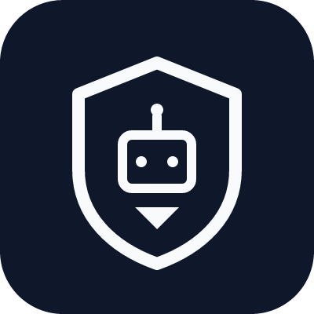
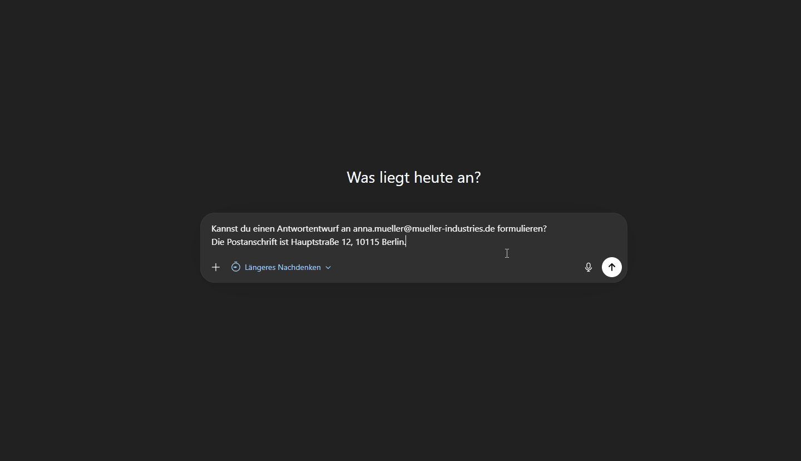
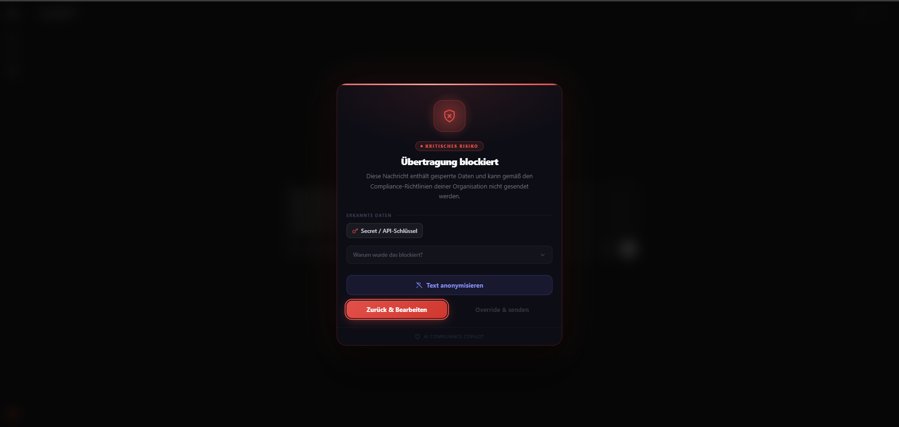
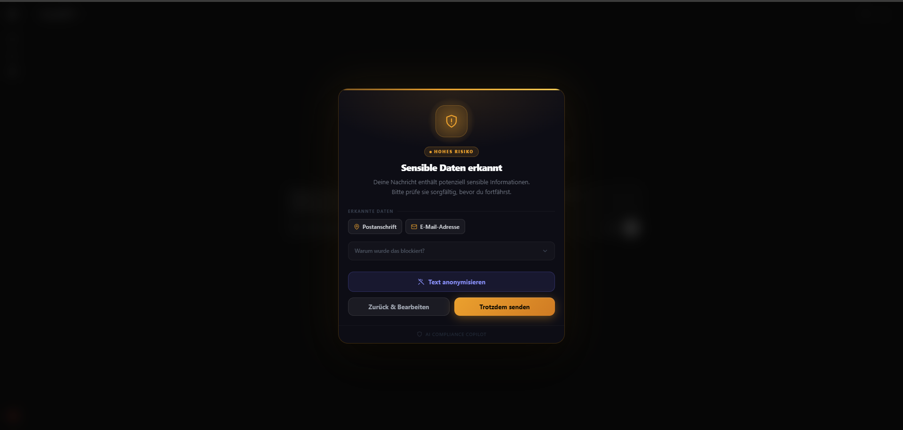
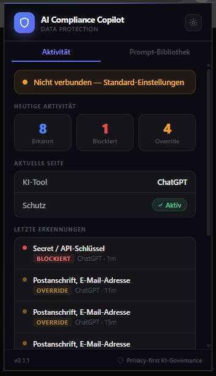
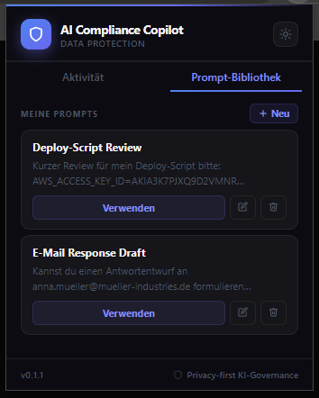

<div align="center">



# AI Compliance Copilot

A browser extension that inspects prompts to public LLMs and flags PII, credentials, and other sensitive content — entirely on-device, before any data leaves the browser.

[](https://github.com/lennardgeissler/ai-compliance-copilot/actions/workflows/ci.yml)
[](LICENSE)
[](tsconfig.base.json)
[](apps/extension/public/manifest.json)



</div>

> **Status:** v0.1.x, pre-1.0. The detection pipeline is production-ready; rule coverage, ergonomics, and the public API are still moving. Pin a tag if you depend on specific behavior.

## Why

Pasting customer records, access keys, or internal source into a public LLM is a leak with no recall. Enterprise DLP catches some of this at the network edge; nothing catches it at the prompt box. This extension runs the check there, in the content script, before the request is issued.

No account, no backend, no telemetry. The detection engine is a pure-TypeScript package with unit tests; you can read the rules in [`packages/detection-engine/src/rules.ts`](packages/detection-engine/src/rules.ts).

## Screenshots

### Overlay

Rendered inline on the LLM page the moment you try to send. Severity decides whether override is available.

<table>
  <tr>
    <td align="center" width="50%">
      <br/>
      <sub><b>Block</b> — high-severity matches (API keys, private keys, payment data) are stopped outright. No override.</sub>
    </td>
    <td align="center" width="50%">
      <br/>
      <sub><b>Warn</b> — mid-severity matches show a review step. Redact in one click, go back, or override with a reason.</sub>
    </td>
  </tr>
</table>

### Popup

<table>
  <tr>
    <td align="center" width="50%">
      <br/>
      <sub><b>Activity</b> — per-day detection stats, current-site protection status, and a feed of recent detections.</sub>
    </td>
    <td align="center" width="50%">
      <br/>
      <sub><b>Prompt library</b> — save and reuse vetted prompts locally. Team prompts are loaded from the optional dashboard when connected.</sub>
    </td>
  </tr>
</table>

## Install

### From source

Until the Chrome Web Store listing is published:

```bash
git clone https://github.com/lennardgeissler/ai-compliance-copilot.git
cd ai-compliance-copilot
pnpm install
pnpm --filter ai-compliance-copilot-extension build
```

Then in Chrome or Edge:

1. Open `chrome://extensions`
2. Enable **Developer mode**
3. **Load unpacked** → `apps/extension/dist`

### Chrome Web Store

Submission is pending. Track in the [issues tracker](https://github.com/lennardgeissler/ai-compliance-copilot/issues).

## Architecture

```
  Prompt input  ──►  Adapter (per tool)  ──►  Content script
                                                   │
                                                   ▼
                                          Detection engine
                                        (rules + validators,
                                         pure TypeScript)
                                                   │
                                                   ▼
                                           Policy engine
                                      (allow / warn / block,
                                       highest severity wins)
                                                   │
                                                   ▼
                             ┌──────────────────────┴──────────────────────┐
                             ▼                                             ▼
                   Allow → forward to LLM                         Overlay (warn/block)
                                                                           │
                                                     Redact · Go back · Override
```

Everything above the overlay runs synchronously in the content script. No network calls, no service-worker round-trips unless the optional dashboard is configured.

Deep dives: [architecture](docs/architecture.md) · [detection engine](docs/detection-engine.md) · [policy engine](docs/policy-engine.md) · [threat model](docs/threat-model.md) · [privacy](docs/privacy.md).

## Detection

Rules combine regex, validators (Luhn, example-domain filters, known-test-card denylist), and a context heuristic that suppresses matches surrounded by words like `example`, `sample`, or `Beispiel`.

| Category                     | Examples                                                                                                                | Default severity |
| ---------------------------- | ----------------------------------------------------------------------------------------------------------------------- | ---------------- |
| `email`, `phone`             | Contact info                                                                                                            | 30 – 40          |
| `iban`, `credit_card`        | Financial (Luhn validated; MOD-97 tracked in [#35](https://github.com/lennardgeissler/ai-compliance-copilot/issues/35)) | 70 – 80          |
| `secret`                     | API keys, AWS keys, bearer tokens, private keys, passwords                                                              | 80 – 95          |
| `address`                    | Postal addresses (incl. German format)                                                                                  | 50               |
| `hr_data`                    | Salary, SSN, Tax-ID                                                                                                     | 60 – 75          |
| `employee_id`, `customer_id` | Internal identifiers                                                                                                    | 35 – 40          |
| `custom_keyword`             | User-defined patterns                                                                                                   | configurable     |

Detection is heuristic — false positives and false negatives are expected. The rule set is tuned against a corpus in [`packages/detection-engine/src/__tests__`](packages/detection-engine/src/__tests__); contributions welcome.

## Supported LLMs

| Tool                                 | Host                             | Status                                                                              |
| ------------------------------------ | -------------------------------- | ----------------------------------------------------------------------------------- |
| ChatGPT                              | `chatgpt.com`, `chat.openai.com` | stable                                                                              |
| Claude                               | `claude.ai`                      | stable                                                                              |
| Gemini                               | `gemini.google.com`              | stable                                                                              |
| Perplexity                           | `www.perplexity.ai`              | stable                                                                              |
| Mistral, Microsoft Copilot, DeepSeek | —                                | planned ([#33](https://github.com/lennardgeissler/ai-compliance-copilot/issues/33)) |
| Firefox / Edge add-on                | —                                | planned ([#11](https://github.com/lennardgeissler/ai-compliance-copilot/issues/11)) |

Adding a tool is one adapter file in [`apps/extension/src/adapters/`](apps/extension/src/adapters/).

## Repository layout

```
apps/
  extension/            Browser extension (Manifest V3, Vite)
packages/
  detection-engine/     Pattern + contextual detection rules (pure TS, unit-tested)
  policy-engine/        Action resolution, compliance scoring
  shared-types/         TypeScript contracts shared across packages
docs/                   Architecture, threat model, privacy, detection internals
scripts/                Release and publish helpers
```

pnpm workspaces + Turborepo. An optional enterprise dashboard lives in a separate, non-public repo; the extension is fully functional without it.

## Privacy

- **No outbound network calls** in standalone mode. Verifiable by watching the DevTools Network tab or reading [`manifest.json`](apps/extension/public/manifest.json) — `host_permissions` are limited to the LLM domains the extension needs to operate on.
- Detection runs on-device; no analytics SDK or telemetry in the extension bundle.
- Redaction is in-memory. The sanitized prompt replaces the original only on explicit user action.
- When the optional dashboard is connected, metadata about incidents (not prompt content) is sent to the configured endpoint. Fields are enumerated in [docs/privacy.md](docs/privacy.md); a full transparency report is tracked in [#21](https://github.com/lennardgeissler/ai-compliance-copilot/issues/21).

## Non-goals

- **Not a substitute for enterprise DLP.** Endpoint and network-layer controls remain the authoritative enforcement point; this extension is the last-mile UX in the browser.
- **Not a guarantee.** Detection is heuristic. A user can disable the extension, override a warn, or paste into an unsupported tool. Treat the compliance score as a signal, not a contract.
- **Not an exfiltration monitor.** There is no activity stream to a backend in standalone mode by design. If you need that, run the optional dashboard.
- **Not scanning attachments or images** yet — file-upload coverage is tracked in [#31](https://github.com/lennardgeissler/ai-compliance-copilot/issues/31).

## Roadmap

Tracked on the [issues tracker](https://github.com/lennardgeissler/ai-compliance-copilot/issues). Near-term themes:

- **Coverage** — file/attachment scanning ([#31](https://github.com/lennardgeissler/ai-compliance-copilot/issues/31)), entropy-based secret detection ([#32](https://github.com/lennardgeissler/ai-compliance-copilot/issues/32)), additional LLM adapters ([#33](https://github.com/lennardgeissler/ai-compliance-copilot/issues/33)).
- **Ergonomics** — icon badge counter ([#29](https://github.com/lennardgeissler/ai-compliance-copilot/issues/29)), per-site toggle shortcut ([#30](https://github.com/lennardgeissler/ai-compliance-copilot/issues/30)), i18n ([#15](https://github.com/lennardgeissler/ai-compliance-copilot/issues/15)).
- **Supply-chain trust** — signed releases + SBOM ([#18](https://github.com/lennardgeissler/ai-compliance-copilot/issues/18)), reproducible builds ([#17](https://github.com/lennardgeissler/ai-compliance-copilot/issues/17)), CodeQL in CI ([#36](https://github.com/lennardgeissler/ai-compliance-copilot/issues/36)).
- **Platform** — Firefox and Edge add-on stores ([#11](https://github.com/lennardgeissler/ai-compliance-copilot/issues/11)), plugin API for custom detectors ([#14](https://github.com/lennardgeissler/ai-compliance-copilot/issues/14)).

## Contributing

Start with [issues labeled `good first issue`](https://github.com/lennardgeissler/ai-compliance-copilot/labels/good%20first%20issue). High-value PRs:

- New detection rules — each with a positive test _and_ a false-positive sample
- Adapters for additional LLM platforms
- False-positive reports with a minimal reproducing prompt
- Translations

See [CONTRIBUTING.md](CONTRIBUTING.md). By contributing you agree to the [Code of Conduct](CODE_OF_CONDUCT.md).

## Security

Please do **not** file public issues for security bugs. Use the [private security advisory](../../security/advisories/new) flow described in [SECURITY.md](SECURITY.md).

## License

[MIT](LICENSE) © Lennard Geißler
